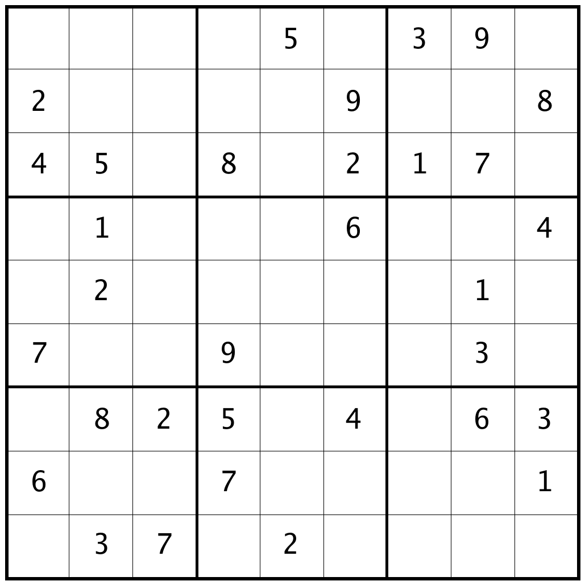

# Sudoku Generator

This little program, which has no external dependencies, is a quite fast procedural [Sudoku](https://en.wikipedia.org/wiki/Sudoku) puzzle generator.

## Usage

```
Usage of ./go-sudoku-gen:
  -output string
        The output path (@seed for auto naming)
  -save-img
        Whether to save the image or not
  -seed int
        The seed; defaults to current unix timestamp (default 1631573683595299425)
  -simple
        Shows a board without UTF-8 borders
```

## How it works

### Generating valid boards

The board is created and filled by randomizing the number that goes in each cell. If a point is reached where it runs out of possible placements, then it attempts to re-fill the board from scratch.

### Generating a puzzle

In order to generate a valid puzzle, the algorithm randomly chooses which cells to empty. At the end, it will verify that there is only one possible solution, otherwise it will attempt to re-generate a puzzle.

## Sample output

``` sh
./go-sudoku-gen -seed 674195711
```

```
╔═══╤═══╤═══╦═══╤═══╤═══╦═══╤═══╤═══╗
║ 9 │ 7 │ 2 ║ 1 │ 4 │ 5 ║ 3 │ 8 │ 6 ║
╟───┼───┼───╫───┼───┼───╫───┼───┼───╢
║ 4 │ 6 │ 3 ║ 8 │ 7 │ 2 ║ 5 │ 1 │ 9 ║
╟───┼───┼───╫───┼───┼───╫───┼───┼───╢
║ 5 │ 1 │ 8 ║ 9 │ 6 │ 3 ║ 4 │ 7 │ 2 ║
╠═══╪═══╪═══╬═══╪═══╪═══╬═══╪═══╪═══╣
║ 7 │ 3 │ 4 ║ 2 │ 5 │ 6 ║ 1 │ 9 │ 8 ║
╟───┼───┼───╫───┼───┼───╫───┼───┼───╢
║ 1 │ 2 │ 9 ║ 4 │ 3 │ 8 ║ 6 │ 5 │ 7 ║
╟───┼───┼───╫───┼───┼───╫───┼───┼───╢
║ 8 │ 5 │ 6 ║ 7 │ 9 │ 1 ║ 2 │ 3 │ 4 ║
╠═══╪═══╪═══╬═══╪═══╪═══╬═══╪═══╪═══╣
║ 2 │ 4 │ 7 ║ 3 │ 1 │ 9 ║ 8 │ 6 │ 5 ║
╟───┼───┼───╫───┼───┼───╫───┼───┼───╢
║ 3 │ 9 │ 5 ║ 6 │ 8 │ 4 ║ 7 │ 2 │ 1 ║
╟───┼───┼───╫───┼───┼───╫───┼───┼───╢
║ 6 │ 8 │ 1 ║ 5 │ 2 │ 7 ║ 9 │ 4 │ 3 ║
╚═══╧═══╧═══╩═══╧═══╧═══╩═══╧═══╧═══╝
╔═══╤═══╤═══╦═══╤═══╤═══╦═══╤═══╤═══╗
║   │   │   ║   │ 4 │ 5 ║ 3 │ 8 │ 6 ║
╟───┼───┼───╫───┼───┼───╫───┼───┼───╢
║   │ 6 │ 3 ║   │   │ 2 ║   │   │ 9 ║
╟───┼───┼───╫───┼───┼───╫───┼───┼───╢
║ 5 │   │ 8 ║   │ 6 │   ║   │   │   ║
╠═══╪═══╪═══╬═══╪═══╪═══╬═══╪═══╪═══╣
║ 7 │ 3 │   ║ 2 │ 5 │   ║ 1 │   │   ║
╟───┼───┼───╫───┼───┼───╫───┼───┼───╢
║   │   │   ║   │   │   ║   │   │   ║
╟───┼───┼───╫───┼───┼───╫───┼───┼───╢
║   │   │ 6 ║   │ 9 │ 1 ║   │ 3 │ 4 ║
╠═══╪═══╪═══╬═══╪═══╪═══╬═══╪═══╪═══╣
║   │   │   ║   │ 1 │   ║ 8 │   │ 5 ║
╟───┼───┼───╫───┼───┼───╫───┼───┼───╢
║ 3 │   │   ║ 6 │   │   ║ 7 │ 2 │   ║
╟───┼───┼───╫───┼───┼───╫───┼───┼───╢
║ 6 │ 8 │ 1 ║ 5 │ 2 │   ║   │   │   ║
╚═══╧═══╧═══╩═══╧═══╧═══╩═══╧═══╧═══╝
Seed: 674195711
Execution time: 5ms
```

## Generating a printable board

You only need to supply the `-save-img` flag. The result looks like this:


